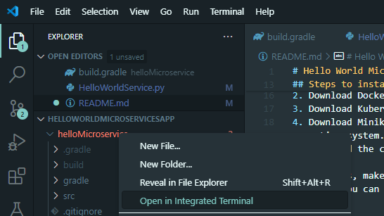
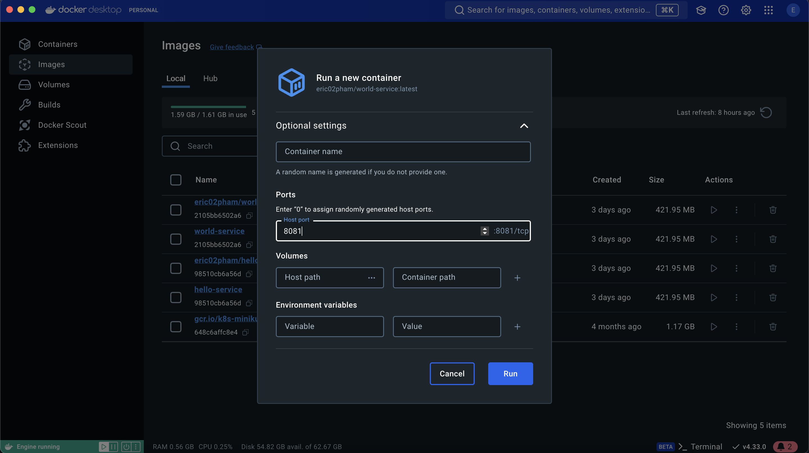
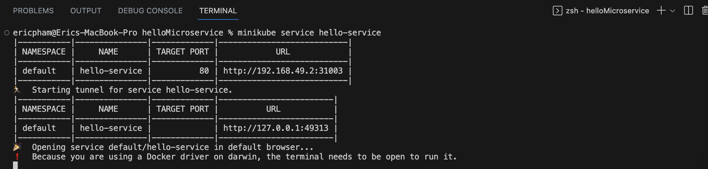

# Hello World Microservices Application
## Project Description
This application uses two Spring Boot projects, each being a microservice, that will communicate 
with each other to return the message "Hello World". Each microservice will be containerized in Docker 
and deployed on a Kubernetes cluster.

## Tools used to deploy application
- Java + Spring Boot
- Docker
- Kubernetes
- Minikube
- Python
- Any IDE (I built this app using Visual Studio Code)

## Steps to install necessary tools
You will first need to download these tools to ensure the project builds correctly.
1. Download the code/clone this GitHub repository. 
2. Download Docker Desktop using the link https://docs.docker.com/get-started/get-docker/ and follow the steps for your operating system.
3. Download Kubernetes using the link https://kubernetes.io/releases/download/ and follow the steps for your operating system. 
4. Download Minikube using the link https://minikube.sigs.k8s.io/docs/start/?arch=%2Fmacos%2Farm64%2Fstable%2Fbinary+download#LoadBalancer and follow the steps for your operating system.
5. Download the correct version of Java. This project uses JDK 17 so any version above 17 should work as well. To check the version, you can run java -version in your terminal. 
6. Download Python using the link https://www.python.org/downloads/ as you will need it to run the script to verify that your microservices are working as intended.

For Windows, make sure that your JAVA_HOME and PATH environment variable is set to the correct Java installation path.
For Mac, you can edit your shell profile to change the JAVA_HOME and PATH environment variable are correct.


## Steps to deploy the application
1. Once you cloned the repository, open the project in your IDE (I used Visual Studio Code).
2. Once you open the project, you can open the integrated terminal for the microservice as shown below.

3. Run `./gradlew clean build` in the integrated terminal for both helloMicroservice and worldMicroservice.
4. Once gradle builds, run the command `docker pull eric02pham/hello-service` and `eric02pham/world-service` in their respective terminal. The docker image should show up in your Docker desktop. 
5. Containerize them by pressing the run button. For this project, change the port of hello-service to 8080 and the port for world-service to 8081.

6. Once you have created the containers, go to your integrated terminal and run the command `minikube start` (keep in mind, if this is the first time you are running Minikube, it will take a bit of time) to build your cluster.
7. After the cluster is built, you will need to apply the Kubernetes manifest so run these following commands:
```
kubectl apply -f hello-service-microservice.yaml
kubectl apply -f hello-deployment-microservice.yaml
kubectl apply -f world-service-microservice.yaml
kubectl apply -f world-deployment-microservice.yaml
```
8. After the manifests have been applied, you can expose the services to Minikube by running the commands:
```
minikube service hello-service
minikube service world-service
```
9. Minikube should provide you links for each service and you can change the endpoints to test if the microservices work as intended. 


## Links to Docker Images
- Hello Microservice: https://hub.docker.com/r/eric02pham/hello-service
- World Microservice: https://hub.docker.com/r/eric02pham/world-service
